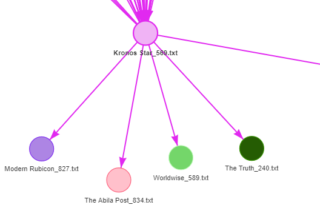
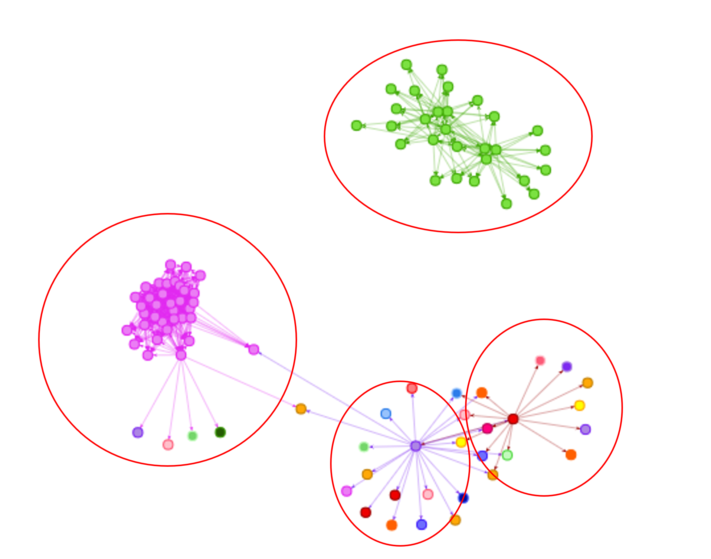
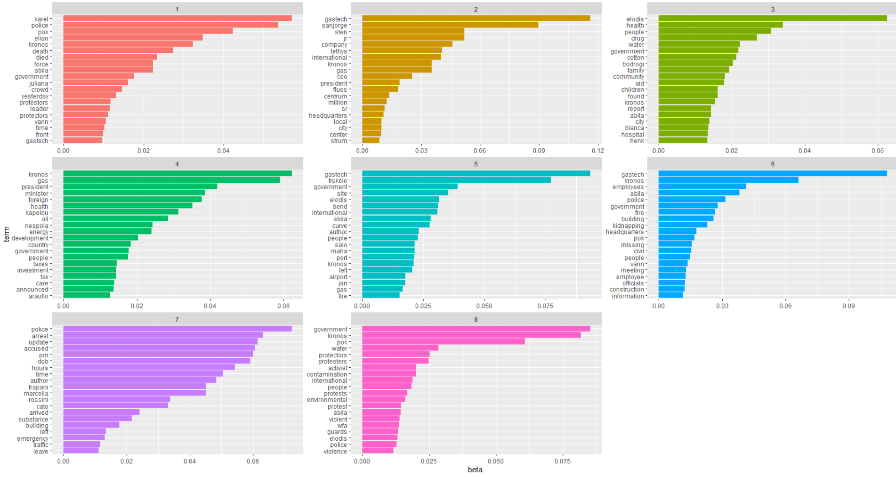
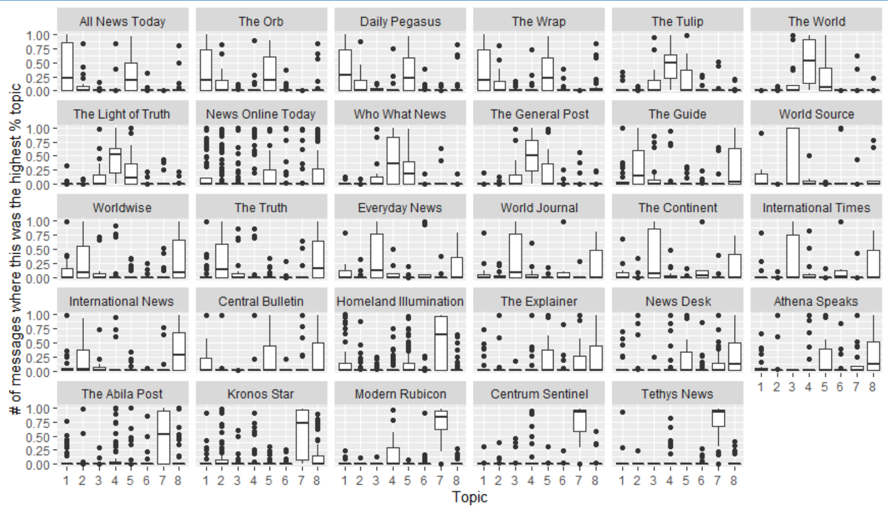
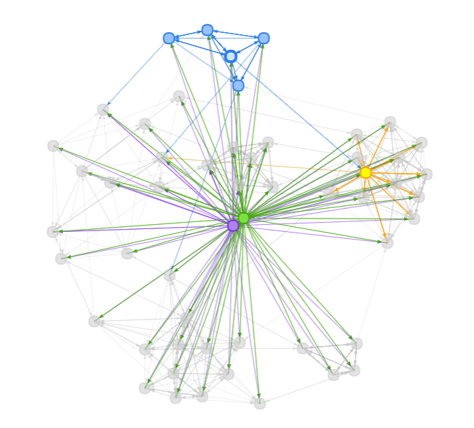
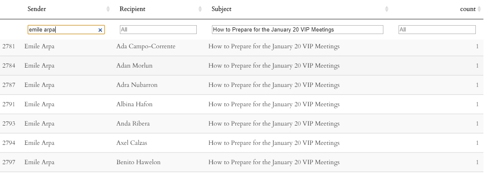
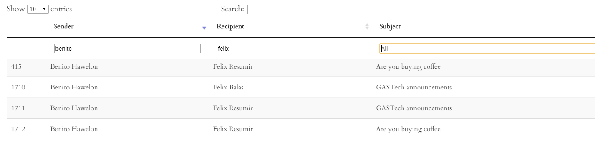

```{r setup, include=FALSE}
knitr::opts_chunk$set(echo = FALSE)
```

# 1. Introduction

For the past 20 years, Tethys-based GAStech has been operating a natural gas production site in the island country of Kronos. They have been largely successful in generating profits and developed strong relationships with the government of Kronos. Unfortunately, their business has not been successful in demonstrating environmental stewardship with the Protectors of Kronos (POK). In January 2014, several employees of GAStech went missing in the midst of a celebration. POK is suspected in the disappearances. 

In this mini-challenge, we are tasked to investigate the complex relationships among people and organizations. I will be answering the following questions:

1. Characterize the news data sources provided. Which are primary sources and which are derivative sources? What are the relationships between the primary and derivative sources?

2. Characterize any biases you identify in these news sources, with respect to their representation of specific people, places, and events. 

3. Given the data sources provided, use visual analytics to identify potential official and unofficial relationships among GASTech, POK, the APA, and Government. Include both personal relationships and shared goals and objectives. Provide evidence for these relationships.

The raw data can be retrieved from this link[https://vast-challenge.github.io/2021/MC1.html]


# 2. Literature Review

By definition, primary sources are first-hand account of an event and represent an original view, reporting on discoveries and events, or sharing new information. A derivative source, on the other hand, typically involves an analysis and/or interpretation of the primary sources. Given the definitions, derivative sources have 2 main traits - (1) similar content to the primary source(s) and (2) published after the primary sources.Using these traits, it is likely to create a network between the primary and secondary sources based on correlations between the word structures. 

Typically, derivative sources are required to quote from their primary source if they would like to use the content in their analysis. However, this might not be present in many occasions.

News sources typically contain some form of bias depending on the intent of the sources. Different newsgroups would also focus on different aspect of the story. In this case, I will use the Latent Dirichlet Allocation (LDA) algorithm to identify key topics. This is based on the assumption that every document is a mixture of topics, and every topic is a mixture of words. 

Finally, the last question requires us to identify the complex relationship between the employees in GAStech. In this scenario, we will use their email correspondences to plot a network graph to show their relationship. We then can deep dive into the email subject headers to understand what kind of correspondence they are involved in. By looking at both information concurrently, we can assume the relationship and objectives between two employees. 


# 3. Question 1 Analysis

Before we can begin analysing the questions, I will first set up the packages required for this project. It can be done with the code chunk listed below.

```{r, echo = TRUE, eval = TRUE}

packages = c('tidytext','widyr','wordcloud',
             'DT','ggwordcloud','textplot',
             'lubridate', 'hms', 'tidyverse',
             'tidygraph', 'ggraph', 'igraph','stringr','tidyr', 'ggplot2',
             'visNetwork', 'topicmodels', 'crosstalk', 'utf8', 'knitr','ldatuning', 'topicmodels','textmineR', "tm", "wordcloud")

for (p in packages) {
  if(!require(p, character.only = T)){
    install.packages(p)
  }
  library(p, character.only = T)
}

```

## 3.1 Data Preparation

First, I have loaded the news articles required for the first question. The code below will read individual text file as one id group and save it as a dataframe

```{r, echo = TRUE, eval = TRUE}

list_of_files <- "C:/Users/aaron/Documents/Aaron Documents/Semester 3/VA/Assignment/Raw Data/News Articles"

read_folder <- function (infolder) {
  tibble(file = dir(infolder,
                    full.names = TRUE)) %>%
    mutate(text = map(file,
                      read_lines)) %>%
    transmute(id=basename(file),
              text) %>%
    unnest(text)
}


raw_text <- tibble(folder =
                     dir(list_of_files,
                         full.names=TRUE)) %>%
  mutate(folder_out = map(folder,
                          read_folder)) %>%
  unnest(cols = c(folder_out)) %>%
  transmute(newsgroup = basename(folder),
            id, text)
write_rds(raw_text, "C:/Users/aaron/Documents/Aaron Documents/Semester 3/VA/Assignment/Raw Data/News Articles/allfiles.rds")

for (col in colnames(raw_text)){
  Encoding(raw_text[[col]]) <- "latin1"}

```

Next, I made use of a ggplot to ensure that the number of files uploaded matches the raw data. I will also do a visual check with the number of files in my repository.

```{r, echo = TRUE, eval = TRUE}
raw_text %>% 
  group_by(newsgroup) %>%
  summarize(messages = n_distinct(id)) %>%
  ggplot(aes(messages, newsgroup)) +
  geom_col(fill = "lightblue") +
  labs(y=NULL)
```

## 3.2 Data Cleaning

Next, I will carry out some data cleaning to make sure it can be evaluated. I have employed the following steps to clean the data.

1. Remove empty lines from the text column. 

```{r, echo = TRUE, eval=TRUE}
raw_text<- raw_text %>%
  #filter(raw_text$text != "") %>%
  filter(raw_text$text != " ")


```

2. Separate the important variables: Location, Published Date, Source, Title and Main Text. This is done by using regular expression to identify the important keywords in the .txt files. I have also renamed and tidied the data to allow data pivoting in the next step. 

```{r, echo = TRUE, eval = TRUE}
sep_text <- raw_text %>%
  separate(text, c('Type', 'entry'), "(?<=LOCATION):|(?<=PUBLISHED):|(?<=SOURCE):|(?<=TITLE):", remove=FALSE)

sep_text$entry[is.na(sep_text$entry)] <- sep_text$Type[is.na(sep_text$entry)] 
sep_text <- sep_text %>%
  mutate(Type = ifelse(entry==Type, "TEXT", Type))

sep_text <- sep_text %>%
  group_by(newsgroup,id,Type) %>%
  summarise (entry = paste(entry, collapse = " "))

sep_text <- sep_text %>%
  unite("newsgroup_id", newsgroup:id, sep = "_")

```

3. Using the pivot wider function to transform the important variables from rows to columns.

```{r, echo = TRUE, eval=TRUE}

wide_text <- sep_text[,c("newsgroup_id","Type","entry")]
wide_text <- pivot_wider(wide_text,
                         names_from = Type,
                         values_from = entry)

wide_text_cleaned <- data.frame(lapply(wide_text,trimws))


```


4. Ensuring that the data type is correct, specifically the published date. This can be done using the parse_date_time function.

```{r, echo = TRUE, eval=TRUE}

wide_text_cleaned$PUBLISHED <- parse_date_time(wide_text_cleaned$PUBLISHED, orders=c("ymd", "dmy HM","mdy","dmy"))
wide_text_cleaned <- data.frame(wide_text_cleaned)

```

## 3.3 Data Preprocessing

1. In this step, I will categorise the data into trigrams, a function that splits the text column into consecutive words. I have also attempted to remove common stopwords from the trigrams. I have decided to use trigrams as it allows better understanding of the sentence structure in the news sources for better correlations. 

This variable will be used as the base for other derivations. 

```{r, echo = TRUE, eval=TRUE}

trigrams_news <- wide_text_cleaned %>%
  unnest_tokens(trigram, TEXT , token = "ngrams", n = 3)

trigrams_news <- trigrams_news %>%
  separate(trigram, into = c("first","second","third"), sep = " ", remove = FALSE) %>%
  anti_join(stop_words, by = c("first" = "word")) %>%
  anti_join(stop_words, by = c("second" = "word")) %>%
  anti_join(stop_words, by = c("third" = "word")) %>%
  filter(str_detect(first, "[a-z]") &
           str_detect(second, "[a-z]") &
           str_detect(third, "[a-z]"))

```

6. Next, I will append the count of each trigrams by newsgroup_id and words. This will show the number of unique trigrams in each news article. 

```{r, echo = TRUE, eval=TRUE}

words_by_newsgroup <- trigrams_news %>%
  count(newsgroup_id, trigram, sort=TRUE) %>%
  separate (newsgroup_id, c('newsgroup','id'), '_', remove=FALSE)


```

7. In order to understand the relationship between different news articles, I will apply pairwise correlation on the trigrams, grouped by unique news articles.


```{r, echo = TRUE, eval=TRUE}
news_cors <- words_by_newsgroup %>%
  pairwise_cor(newsgroup_id,
               trigram,
               n,
               sort=TRUE)

```

8. As I will be plotting a Network graph, there is a need to rename the columns to fit the requirements.

```{r, echo = TRUE, eval=TRUE}
news_cors_aggregated <- news_cors %>%
    rename(
    to = item1,
    from = item2)

news_cors_node <- wide_text_cleaned %>%
  rename(
    id = newsgroup_id,
    group = SOURCE
  )

```

9. Next, I will continue to clean the dataq to ensure that the headers are of the correct names and all the columns have remained. 

```{r, echo = TRUE, eval=TRUE}
news_cors_aggregated_joined <- news_cors_aggregated %>%
  inner_join(news_cors_node, by = c("to"= "id")) %>%
  inner_join(news_cors_node, by = c("from" = "id"))

news_cors_aggregated_joined <- news_cors_aggregated_joined[c("from","to","correlation","PUBLISHED.x","PUBLISHED.y")]

news_cors_aggregated_joined_sort <- news_cors_aggregated_joined %>%
  arrange(desc(correlation), PUBLISHED.x)

```

10. We will only want to keep the correlation where the published date in the from column is earlier than the to column. This will ensure that the network graph plotted later will only show the primary sources pointing to the secondary sources. In the above step, I have arranged the data based on correlation and published date in the "from" column. The next step of code will remove every 2nd entry. 

```{r, echo = TRUE, eval=TRUE}

ind <- seq(1,nrow(news_cors_aggregated_joined_sort),by=2)
news_cors_aggregated_joined_sort_noduplicates <- news_cors_aggregated_joined_sort[ind,]

head(news_cors_aggregated_joined_sort_noduplicates,n=10)

```


11. I will do one final tidying of the data before loading into visNetwork. I have filtered out the correlations that is less than 0.40 as we want to look at news that are more closely related. I have also kept the top-30 count of networks to streamline the data on the network plot.

```{r, echo = TRUE, eval=TRUE}
news_cors_aggregated_joined_sort_noduplicates_50 <- news_cors_aggregated_joined_sort_noduplicates %>%
  filter(correlation >= 0.40)


news_cors_aggregated_joined_sort_noduplicates_50_top_10 <- news_cors_aggregated_joined_sort_noduplicates_50 %>%
  count(from) %>%
  top_n(30)

news_cors_aggregated_joined_sort_noduplicates_final <- news_cors_aggregated_joined_sort_noduplicates_50 %>%
  inner_join(news_cors_aggregated_joined_sort_noduplicates_50_top_10, by = "from")


news_cors_node_filtered <- news_cors_node[(news_cors_node$id %in% news_cors_aggregated_joined_sort_noduplicates_final$from)| (news_cors_node$id %in% news_cors_aggregated_joined_sort_noduplicates_final$to),]

```

12. Plotting the visNetwork graph to understand the network.

```{r, echo = TRUE, eval=TRUE}
visNetwork(news_cors_node_filtered,
           news_cors_aggregated_joined_sort_noduplicates_final) %>%
  visEdges(arrows="from") %>%
  visIgraphLayout(layout = "layout_with_fr") %>%
  visOptions(highlightNearest = list(enabled = TRUE),
             nodesIdSelection = TRUE,
             selectedBy = "group") %>%
  visLayout(randomSeed = 123)


```

## 3.4 Analysis

1. From the network plot, we are able to differentiate the primary and the derivative sources. News sources that are closely correlated are linked together. The direction of the arrows will point from the primary source to the derivative source for articles that are closely correlated. In the case below, Kronos Star_569 seemed to be the primary source to Modern Rubicon_827, The Abila Post_834, Worldwise_589 and The Truth_240.



2. Looking at the overall network grpah, we can identify 4 main clusters based on trigrams correlations in the text. We will look further into the relationships between these clusters. 



__Cluster 1: Homeland Illumination Correlations__

A deeper analysis into the articles for Homeland Illumination indicates that the reports are live updates of the GAStech celebration and the subsequently the fire incident. This resulted in the highly correlated trigrams analysis of the text document. 

Given that majority of Homeland Illumination occurs in a cluster, I will plot a wordcloud to understand the main topic of the cluster. 

``````{r, echo = TRUE, eval=TRUE}

cluster1_cloud <- wide_text_cleaned %>%
  filter(SOURCE=="Homeland Illumination")
cluster1_cloud <- Corpus(VectorSource(cluster1_cloud$TEXT))
  
cluster1_cloud <- tm_map(cluster1_cloud, removeNumbers)
cluster1_cloud <- tm_map(cluster1_cloud, removeWords, stopwords("english"))
cluster1_cloud <- tm_map(cluster1_cloud, removePunctuation)
cluster1_cloud <- tm_map(cluster1_cloud, stripWhitespace)

dtm_cluster1 <- TermDocumentMatrix(cluster1_cloud)
m_cluster1 <- as.matrix(dtm_cluster1)
v_cluster1 <- sort(rowSums(m_cluster1),decreasing=TRUE)
d_cluster1 <- data.frame(word = names(v_cluster1),freq=v_cluster1)

set.seed(2020)
wordcloud(words = d_cluster1$word,freq = d_cluster1$freq, min.freq = 1,
          max.words=100, random.order=FALSE, rot.per=0.35, 
          colors=brewer.pal(8, "Dark2"), scale = c(3,0.2))

```

The wordcloud generated also gives a summary of the events that happened on the day of celebration as well as the fire.

__Cluster 2: Kronos Star Correlations__

Another cluster occurs with the Kronos Star. Similar to the clusters for Homeland Illumination, Kronos Star was reporting on the GAStech celevbration, fire incident and kidnapping of GAStech employees. 

However, it is interesting to note that there are 4 external articles that are closely related to the Kronos Star_569 which talks about the unconfirmed reports regarding GAStech executives arriving at the scheduled reception. I will examine the articles and provide a summary.

``````{r, echo = TRUE, eval=TRUE}

cluster2_cloud <- wide_text_cleaned %>%
  filter(newsgroup_id %in% c("Modern Rubicon_827.txt","The Abila Post_834.txt", "Worldwise_589.txt", "The Truth_240.txt","News Online Today_40.txt"))

cluster2_cloud <- Corpus(VectorSource(cluster2_cloud$TEXT))
  
cluster2_cloud <- tm_map(cluster2_cloud, removeNumbers)
cluster2_cloud <- tm_map(cluster2_cloud, removeWords, stopwords("english"))
cluster2_cloud <- tm_map(cluster2_cloud, removePunctuation)
cluster2_cloud <- tm_map(cluster2_cloud, stripWhitespace)

dtm_cluster2 <- TermDocumentMatrix(cluster2_cloud)
m_cluster2 <- as.matrix(dtm_cluster2)
v_cluster2 <- sort(rowSums(m_cluster2),decreasing=TRUE)
d_cluster2 <- data.frame(word = names(v_cluster2),freq=v_cluster2)

set.seed(2020)
wordcloud(words = d_cluster2$word,freq = d_cluster2$freq, min.freq = 1,
          max.words=100, random.order=FALSE, rot.per=0.35, 
          colors=brewer.pal(8, "Dark2"), scale = c(3,0.2))

```

These articles are reported on 19 January, while the Kronos Star article is reported on 20 April. These articles are closely correlated because of the executive attendees and details of the reception. 

__Cluster 3: Modern Rubicon_159 Cluster Correlations__

This cluster focuses on CEO Sten Sanjorge Jr and the situation surrounding the kidnapping.

``````{r, echo = TRUE, eval=TRUE}

cluster3_cloud <- wide_text_cleaned %>%
  filter(newsgroup_id %in% c("The Wrap_704.txt", "News Online Today_711.txt", "The Abila Post_764.txt", 
                             "Tethys News_726.txt", "The Light of Truth_494.txt", 
                             "The General Post_192.txt", "The General Post_826.txt", "Kronos Star_481.txt", "News Online Today_65.txt", 
                             "News Online Today_344.txt", "Worldwise_591.txt", "News Online Today_40.txt", "Kronos Star_692.txt", 
                             "Central Bullentin_618.txt", "Daily Pegasus_602.txt", "The Orb_148.txt", "The Light of Truth_560.txt", 
                             "The Abila Post_654.txt", "The Tulip_178.txt", "Modern Rubicon_159.txt", "Centrum Sentinel_597.txt", 
                             "Tethys News_122.txt", "New Online Today_344.txt"))


cluster3_cloud <- Corpus(VectorSource(cluster3_cloud$TEXT))
  
cluster3_cloud <- tm_map(cluster3_cloud, removeNumbers)
cluster3_cloud <- tm_map(cluster3_cloud, removeWords, stopwords("english"))
cluster3_cloud <- tm_map(cluster3_cloud, removePunctuation)
cluster3_cloud <- tm_map(cluster3_cloud, stripWhitespace)

dtm_cluster3 <- TermDocumentMatrix(cluster3_cloud)
m_cluster3 <- as.matrix(dtm_cluster3)
v_cluster3 <- sort(rowSums(m_cluster3),decreasing=TRUE)
d_cluster3 <- data.frame(word = names(v_cluster3),freq=v_cluster3)

set.seed(2020)
wordcloud(words = d_cluster3$word,freq = d_cluster3$freq, min.freq = 1,
          max.words=100, random.order=FALSE, rot.per=0.35, 
          colors=brewer.pal(8, "Dark2"), scale = c(3,0.2))
```
This cluster is also correlated to the second clusters links from News Online Today_40 and Kronos Star_692 as the primary source. 

__Cluster 4: The General Post_536 Correlations__

This cluster focuses on the actions of GAStech on the environment and POK's involvement in the situation. There were mentions of the environmental impacts and the kinapping alledgedly carried out by POK. 

``````{r, echo = TRUE, eval=TRUE}

cluster4_cloud <- wide_text_cleaned %>%
  filter(newsgroup_id %in% c("The Light of Truth_822.txt", "Modern Rubicon_452.txt", "Centrum Sentinel_624.txt", 
                             "News Online Today_219.txt", "The World_824.txt", "Who What News_310.txt", 
                             "The Light of Truth_560.txt", "The Orb_148", "The Abila Post_654.txt", "The Tulip_178.txt",
                             "Tethys News_122.txt", "The Explainer_667.txt"))


cluster4_cloud <- Corpus(VectorSource(cluster4_cloud$TEXT))
  
cluster4_cloud <- tm_map(cluster4_cloud, removeNumbers)
cluster4_cloud <- tm_map(cluster4_cloud, removeWords, stopwords("english"))
cluster4_cloud <- tm_map(cluster4_cloud, removePunctuation)
cluster4_cloud <- tm_map(cluster4_cloud, stripWhitespace)

dtm_cluster4 <- TermDocumentMatrix(cluster4_cloud)
m_cluster4 <- as.matrix(dtm_cluster4)
v_cluster4 <- sort(rowSums(m_cluster4),decreasing=TRUE)
d_cluster4 <- data.frame(word = names(v_cluster4),freq=v_cluster4)

set.seed(2020)
wordcloud(words = d_cluster4$word,freq = d_cluster4$freq, min.freq = 1,
          max.words=100, random.order=FALSE, rot.per=0.35, 
          colors=brewer.pal(8, "Dark2"), scale = c(3,0.2))
```

# 4. Question 2 Analysis

In this question, I will make use of Latent Dirichlet Allocation (LDA) to identify topics presented in each newsgroup. I have decided to use LDA as LDA treats each document as a mixture of topics and every topic as a mixture of words. Given the generative statistical nature of LDA, we hope that it will explain why some part of the data are similar. With that, we can extract the bias behind the articles. 

## 4.1 Data Preparation

1. First, I will tokenize the words based on the TEXT column. This is to prepare the data for LDA on the TEXT column to understand the context. 

```{r, echo = TRUE, eval=TRUE}

tidy_source_text <- wide_text_cleaned %>%
  unnest_tokens(word,TEXT) %>%
  filter(!word %in% stop_words$word,
         !word %in% str_remove_all(stop_words$word, "'"),
         str_detect(word, "[a-z]")) %>%
  group_by(word) %>%
  mutate(count = n()) %>%
  ungroup() %>%
  filter(count>30)
```

2. Next, I have divided up the articles based on the different news sources. This will be processed into a document term matrix with cast_dtm. This will be fed into the LDA model for topics analysis. 

```{r, echo = TRUE, eval=TRUE}
tidy_source_dtm <- tidy_source_text %>%
  unite(document,SOURCE,newsgroup_id) %>%
  count(document, word) %>%
  cast_dtm(document, word, n)

```


## 4.2 Data Preprocessing

1. Now, I am ready to fit the document term matrix into the LDA model. One of the parameter required is the number of topics to be generated. To determine the optimal number of topics, I have used the ldatuning package to tune the optimal number of topics, based on the existing dataset. This package uses 4 metrics to select the number of topics for the LDA model. 

2. From the plot below, the optimal number of topics generated is 8, and I will use this parameter to run the LDA model. The idea behind this method is to find the extremum by minimizing the Arun2010/CaoJuan2009 model and maximising Deveaud2014/Griffiths2004 models. 

```{r, echo = TRUE, eval=TRUE}

result <- FindTopicsNumber(
  tidy_source_dtm,
  topics = seq(from = 2, to =15, by =1),
  metrics = c("Griffiths2004", "CaoJuan2009", "Arun2010", "Deveaud2014"),
  method = "Gibbs",
  control = list(seed = 20202),
  mc.cores = 2L,
  verbose = TRUE
  
)

FindTopicsNumber_plot(result)

```

3. Next, I am ready to fit the model into the LDA model with k=8. I will visualise the results with ggplot2, facet plot to show the top-10 words for each topic. 

```{r, echo = TRUE, eval=FALSE}
tidy_source_lda <- LDA(tidy_source_dtm, k=8, iterations = 500)

set.seed(2020)
tidy_source_lda  %>%
  tidy() %>%
  group_by(topic) %>%
  slice_max(beta, n = 20 ) %>%
  ungroup() %>%
  mutate(term = reorder_within(term, beta, topic)) %>%
  ggplot(aes(beta, term, fill = factor(topic))) +
  geom_col(show.legend = FALSE) +
  facet_wrap(~ topic, scales = "free") +
  scale_y_reordered()

```



## 4.3 Analysis

1. Now we are ready to analyse the data. From facet graph generated, I have summarised the plausible topics from the words generated, and categorised them based on the bias. I will do this based on the summary of the words, as well as deep diving into the news articles to better understand the backgroud.

Topic 1: Death of Karel (in jail) and Vann (due to contamination) - People focused  
Topic 2: Celebration of GAStech achievements - People focused  
Topic 3: Complications by designer drugs - People focused  
Topic 4: Death of Health Minister and new appointment - People focused  
Topic 5: Gastech developments over the years - Event focused  
Topic 6: Kidnapping Incident - Event focused  
Topic 7: Demonstration - People focused  
Topic 8: Contamination of water - Event focused  

2. Next, I will classify the topics based on the SOURCE, and understand what each source is reporting. I can confirm this by comparing the "gamma" value for each topic. 

```{r, echo = TRUE, eval=FALSE}
set.seed(2020)
tidy_source_lda %>%
  tidy(matrix = "gamma") %>%
  separate(document, c("SOURCE","newsgroup_id"), sep = "_") %>%
  mutate(SOURCE = reorder(SOURCE, gamma * topic)) %>%
  ggplot(aes(factor(topic), gamma)) +
  geom_boxplot() +
  facet_wrap(~ SOURCE) +
  labs(x = "Topic",
       y = "# of messages where this was the highest % topic")

```



3. From the above summary chart, I have noticed that there are some news sources that might have overlapping topics. This is normal in LDA modeling. To evaluate the news sources, I will provide some examples on analysing the news articles based on the topics.

__Kronos Star News Articles__

From the above observation, we can derive that Kronos Star have reported news surrounding the demonstration and effects of the water contamination (Topic 7 and Topic 8). A deeper analysis into the news articles from Kronos Star indicates that Kronos Star was providing live updates in the protests. The reporting was also focused on the role of POKs in the demonstration and suspected kidnapping of GAStech employees. 

Judging from the tone of the articles, there is a slight bias in against the POKs in terms of the reporting given that majority of the news are focused on the roles played by the POKs. They were also portrayed negatively since words such as violent, accused and protests are used in the reporting. 


__All News Today News Articles__

On the other hand, we derived that All News Today mainly reported on news surrounding people (Topic 1 and Topic 4). A closer analysis into the news articles indicates that the newsgroup has done articles that includes the activities that happened to the key characters involved in the situation. 

In contrary to Kronos Star, the tone of the articles seemed to have a bias for POKs. The articles mainly depicted the support of key POK members suggesting reasons for starting the protests to protect the environment. 

# 5. Question 3 Analysis

In this question, I will prepare a network graph to understand the correspondence between different employees based on their emails. To further understand their relationship, we can deep dive by looking at subject headers of the emails and understand the relationship and objectives between different employees. 

## 5.1 Data Preparation

1. First, I have loaded the data provided - employees and email records. I have also done some simple data cleaning to remove information that are not useful for text analysis. I have also ensured that the data type is consistent.

```{r, echo = TRUE, eval=TRUE}
employees_records <- readxl::read_xlsx("C:/Users/aaron/Documents/Aaron Documents/Semester 3/VA/Assignment/Raw Data/EmployeeRecords.xlsx")
employees_records_cleaned <- employees_records %>%
  unite(fullname, FirstName, LastName, sep = " ", remove=FALSE) %>%
  mutate_if(is.character, utf8_encode)

employees_records_cleaned$fullname <- trimws(employees_records_cleaned$fullname, which = c("both"))

email_records <- read_csv("C:/Users/aaron/Documents/Aaron Documents/Semester 3/VA/Assignment/Raw Data/email headers.csv")
email_records_cleaned <- email_records %>%
  mutate(To = str_remove_all(To,"@gastech.com.kronos|@gastech.com.tethys")) %>%
  mutate(To = str_replace_all(To, "[.]", " ")) %>%
  mutate(From = str_remove_all(From,"@gastech.com.kronos|@gastech.com.tethys")) %>%
  mutate(From = str_replace_all(From, "[.]", " ")) %>%
  mutate(Date = parse_date_time(x = Date, orders =c("%m%d%y %H%M","%m%d%y"))) %>%
  mutate_if(is.character, utf8_encode)

email_records_cleaned2 <- strsplit(email_records_cleaned$To, split=",")
email_records_cleaned2 <- data.frame(From = rep(email_records_cleaned$From, sapply(email_records_cleaned2, length)), 
                                     To = unlist(email_records_cleaned2), Date = rep(email_records_cleaned$Date, 
                                                                                     sapply(email_records_cleaned2, length)),
                                     Subject =  rep(email_records_cleaned$Subject, sapply(email_records_cleaned2, length)))
email_records_cleaned2$To <- trimws(email_records_cleaned2$To, which = c("both"))
email_records_cleaned2$From <- trimws(email_records_cleaned2$From, which = c("both"))
email_records_cleaned2$Subject <- gsub("[[:punct:]]", "", email_records_cleaned2$Subject)


```

2. Next, I will prepare the node and edge dataframe to build a network diagram using visNetowrk. This will allow us to view who are linked together. It indicates some form of communication and relationship between them. The node and edge dataframe needs to have pre-defined column name and format for the function to plot the relevant graph. The edge list is also aggregated to based on the sender, recipient and subject. 

```{r, echo = TRUE, eval=TRUE}

#Tidying node list
employees_records_cleaned_rename <- employees_records_cleaned %>%
  rename(id = fullname) %>%
  rename (group = CurrentEmploymentType) %>%
  arrange(id)

#Tidying edge list

email_records_cleaned2_rename <- email_records_cleaned2 %>%
  rename (from = From) %>%
  rename (to = To) %>%
  mutate(Subject = str_remove_all(Subject,"RE"))

email_records_cleaned2_rename_aggregated <- email_records_cleaned2_rename %>%
  group_by (from, to, Subject) %>%
  summarise(Weight = n()) %>%
  filter(from!=to) %>%
  filter(to!=from) %>%
  filter(Weight > 1) %>%
  ungroup()

```

## 5.2 Data Preprocessing

1. We are now ready to plot a visNetwork graph to show communication between individual staff and departments.

```{r, echo = TRUE, eval=TRUE}
visNetwork(employees_records_cleaned_rename,
           email_records_cleaned2_rename_aggregated) %>%
  visEdges(arrows="to") %>%
  visIgraphLayout(layout = "layout_with_fr") %>%
  visOptions(highlightNearest = TRUE,
             nodesIdSelection = TRUE,selectedBy = "group", collapse=TRUE) %>%
  visLayout(randomSeed = 123) %>%
  visLegend()
```

2. Next, I have prepared a datatable that allows filtering. This will give a list of correspondents and subject headers of the email sent. It will be useful to determine the relationship between different employees in the organisation. 

```{r, echo = TRUE, eval=TRUE}

email_records_analysis <- email_records_cleaned2_rename %>%
  group_by(from,to,Subject) %>%
  summarise(count=n()) %>%
  filter(from!=to) %>%
  arrange(desc(count)) %>%
  filter(count>0) %>%
  rename(c("Sender" = "from","Recipient" = "to"))

datatable(email_records_analysis, filter='top', options = list(
  autoWidth = TRUE, scrollX = TRUE, scrollCollapse = TRUE), extensions = "FixedColumns")

```

## 5.3 Analysis

1. First, I have summarised the list of unique topics to understand the different types of correspondence between employees. From the diagram below, we can understand the number of correspondence between different members of the staff. The datatable is interactive and can be filtered based on Subject. 

```{r, echo = TRUE, eval=TRUE}

emails_records_summary <- email_records_cleaned2_rename %>%
  filter(from!=to) %>%
  group_by(Subject) %>%
  summarise(count=n()) %>%
  arrange(desc(count)) %>%
  filter(count>0)

datatable(emails_records_summary, filter='top', options = list(autoWidth = TRUE, scrollX = TRUE, scrollCollapse = TRUE), extensions = "FixedColumns")

```

2. Upon closer inspection, while some of the email subjects might indicate some personal relationship (casino nights, planning for staff picnic), they are in fact events initiated by the company and are sent to all employees. We will ignore these emails. 

3. Next, an observation from the network analysis showed that 2 staff have the highest number of correspondence with the employees. They are namely, Linnea Bergan and Ruscella Mies Haber from the administration team and information technology team. Upon closer inspection in the email headers, we can conclude that emails they have sent are group emails  with regard to administrative and Information Technology related topics. As such, it is likely that they are the main point of contact to send blast emails to all the employees. 

4. In the next few steps, I will summarise some of the relationships between employees based on the email topics. 

__CEO Sten Sanjorge Network__

{width=75%}

From the network graph, we can tell that Sten has frequent communication between his Executive team presumably on the outcomes of the business. However, we can use the datatable to determine what kind of correspondences are happening between his executive co-workers.


It seemed that Sten has personal relationships with Ada Campo, Orhan Strum and William Vasco as there were emails going back and forth with regards to an impromptu golf game and asking for recommendation for a good vacation spot. In addition to the personal relationship, there are also work related emails pertaining to the business. 

The only exception is Ingrid Barranco only spoke to Sten with regard to work, and more specifically finance related topics, given her role as the CFO. 

Another interesting correspondence is with Henk Mies, a Truck Driver from the Facilities department. Unfortunately, we only have the subject title of the email and is only labeled "files". However, it is rather strange that this correspondence was bilateral, without involving any other employees. One possible hypothesis is that this is a personal file from Henk that is required by CEO.     


__Facilities Department Network__

The facilities department seemingly have a close personal relationship with one another, seemingly from the Guys Night Out invite extended to the department. The information can be retrieved from the data table.


However, it might interesting to note that Bertrand Ovan, being the Facilities Group Manager, did not any correspondence with other departments.Instead, any cross departmental communications are managed by the other team members. 

For instance, the preparation for the January 20 VIP meeting was managed primarily by Emile Arpa, a janitor by designation. The instructions were primarily initiated by Emile to other departments, including the executive team. Bertrand was however kept in the loop of the matters. 



Another staff, Benito Hawelon, also has personal correspondence with Felix Resumir regarding a coffee run and GASTech announcements. This could indicate some form of personal relationship between the two employees. This is an unique email between both employees and does not include others. 



5. The above indicates the methodology to retrieve relationships between different employees of GAStech. A similar analysis can be conducted using the the network graph and data table with the email subjects. However, one limitation is that the data given only showcases Subject, and not the detail of the emails. As such, there are generic email titles that I was unable to ascertain the real message, and could only make on a best guess based on the department, subject and possible situation. 

# 6. Conclusion

In conclusion, given the highly unstructured data of news sources and employees email correspondence, we are able to use the data, with some simple data manipulation, to form an impressions on the networks and relationship between news sources and people. 

The next step is to build a shiny application where more could be automated for deeper analysis and insights. 


# 7. References

[1] UNSW Sydney. (n.d.). Primary and secondary sources. UNSW Sydney Library. https://www.library.unsw.edu.au/study/information-resources/primary-and-secondary-sources#:~:text=Primary%20sources%20provide%20a%20first,they%20can%20share%20new%20information.&amp;text=Secondary%20sources%20involve%20analysis%2C%20synthesis,or%20evaluation%20of%20primary%20sources. 


[2] Rajkumar Arun, V. Suresh, C. E. Veni Madhavan, and M. N. Narasimha Murthy. 2010. On finding the natural number of topics with latent dirichlet allocation: Some observations. In Advances in knowledge discovery and data mining, Mohammed J. Zaki, Jeffrey Xu Yu, Balaraman Ravindran and Vikram Pudi (eds.). Springer Berlin Heidelberg, 391–402. http://doi.org/10.1007/978-3-642-13657-3_43

[3] Cao Juan, Xia Tian, Li Jintao, Zhang Yongdong, and Tang Sheng. 2009. A density-based method for adaptive lda model selection. Neurocomputing — 16th European Symposium on Artificial Neural Networks 2008 72, 7–9: 1775–1781. http://doi.org/10.1016/j.neucom.2008.06.011

[4] Romain Deveaud, Éric SanJuan, and Patrice Bellot. 2014. Accurate and effective latent concept modeling for ad hoc information retrieval. Document numérique 17, 1: 61–84. http://doi.org/10.3166/dn.17.1.61-84

[5]Thomas L. Griffiths and Mark Steyvers. 2004. Finding scientific topics. Proceedings of the National Academy of Sciences 101, suppl 1: 5228–5235. http://doi.org/10.1073/pnas.0307752101


