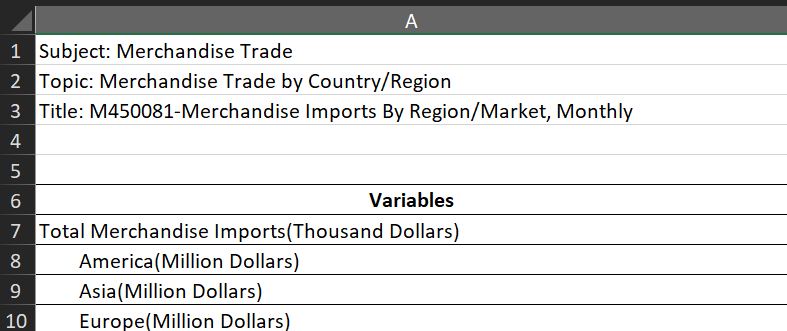
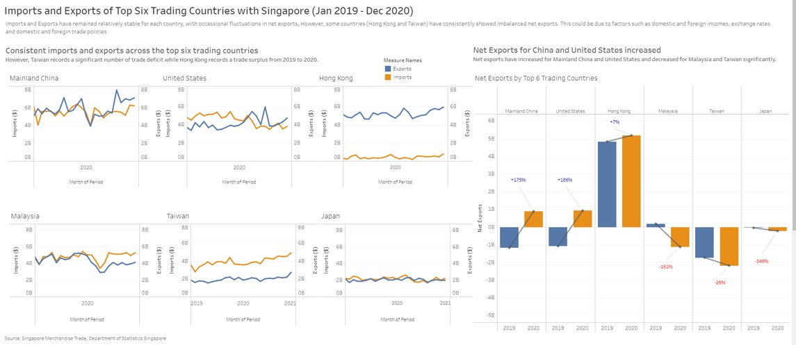

```{r setup, include=FALSE}
knitr::opts_chunk$set(echo = FALSE)

# Learn more about creating blogs with Distill at:
# https://rstudio.github.io/distill/blog.html

```
# 1. Introduction

For the first DataViz makeover assignment, I will be looking at Merchandise Trade by Region/Market, with data extracted from the Department of Statistics (DOS), Singapore. I will be looking at the import and export numbers from 6 countries - Hong Kong, Mainland China, Japan, Malaysia, Taiwan, US.  

The data is made available under the sub-section of [Merchandise Trade by Region/Market](https://www.singstat.gov.sg/find-data/search-by-theme/trade-and-investment/merchandise-trade/latest-data).

# 2. Objectives

This chart aims to show imports and exports trends of the top six countries historically with the highest trade. This is important as a country's imports and exports activity can affect her Gross Domestic Product (GDP), exchange rate, inflation and interest rates. By understanding the patterns, policy-makers are able to look into country-specific trade strategies that may overcome any deficits.  

# 3. Evaluation of the original visualisation

I will first examine the original visualisation from the data (Figure 1) and critique based on the clarity and aesthetics. 


## 3.1. Clarity

a. Chart labels (y-axis) are inconsistent for all six countries. For instance, Hong Kong's exports uses $2M interval while imports uses $200K interval. This gives an inaccurate first impression that imports have exceeded exports for some months.Similarly, by comparing between countries, it seems that Malaysia and Taiwan have similar imports and exports numbers. Upon closer look, it is observed that Malaysia has twice the amount of exports compared to Taiwan. 

b. The period (x-axis) presented in the chart is inconsistent with the title. Japan only had data from 2020, while the remaining countries have data presented from 2019-2021. The chart title showed 2019-2020 instead. Nonetheless, the title was clear in showing the reasons for choosing the top six countries.

c. Y-Axis is not properly labeled with units. It could be misinterpreted as trade volume instead of trade amount.X-axis is clear. 

d. There could be a short paragraph summarising the objectives of the visualisation. This might give the reader a clearer picture. 

e. There could be annotations on the graph to highlight key observations.


## 3.2. Aesthetics

a. Area graph may not be the most appropriate chart. Due to the overlapping colours, it is difficult to visualise the export trends when its value falls below import value. A line graph might be more appropriate.  

b. Usage of colours in the chart is consistent, and easy to differentiate. 

c. The legend (measures names) could be placed between the top and bottom row for better visualisations. 

# 4. Proposed Graphical Representation

## 4.1. Sketch 

In this section, I will proposed an alternative graphical representation of the data. 

{width=50%}

## 4.2. Advatanges of proposed design

1. I have replaced the area graph with a line graph. This will allow better view of the data especially if there are any overlaps. 

2. The y-axis of both imports and exports have the same interval. This will give a more accurate representation when comparing within and across the countries. 

3. Derived a new measure called net exports to understand if there are any trade deficit/surplus with certain countries. The data is aggregated by years to understand the change in net exports in 2019 and 2020. 


# 5. Step-by-step description for the makeover

In this section, I will be providing a step-by-step guide for the makeover in Tableau Prep Builder. I will make use of 2 tables:  
**T1:** Merchandise Imports By Region/Market, Monthly  
**T2:** Merchandise Exports By Region/Market, Monthly  

## 5.1. Data Preparation (I)

1. Remove the rows 1-5 from Excel T1 and T2 to facilitate upload onto Tableau Prep Builder.

{width=50%}


2. Create a new Tableau Worksheet, and connect to the cleaned excel file.

{width=50%}

3. Three tables corresponding to three worksheet is the excel is extracted. 

{width=50%}


4. Drag T1 into the workplace and the data points will be automatically populated. 

{width=75%}

5. Filter the data based on the period (Jan 2019 - Dec 2020)

{width=50%}

6. Pivot the data (except the first column) to get a thinner table suitable for visualisation. I have also renamed the 3 new columns as Period, Imports and Countries respectively. 

{width=75%}

7. Change the data type of the period from string to date

{width=50%}

8. Extract the table and save it as T1(outputFile)

{width=75%}

9. Repeat the same process for T2, and save it as T2(outputFile)

## 5.2. Data Preparation (II)

10. Open a new workbook and import T1(outputFile)

11. Filter the data based on the countries (Hong Kong, China, Taiwan, US, Malaysia and Japan)

{width=100%}

12. Toggle to T2(OutputFile) and drag the table into the workspace. This creates a join between the two tables.

{width=100%}
13. Rename the new fields accordingly. Period (Imports, Exports), Imports, Exports, Countries (Imports, Exports)

14. Click on the join settings. Inner join is used on period and countries of both tables.
{width=75%}

## 5.3. Creating Visualisations - Imports and Exports

15. First, I will create 6 different line charts showcasing imports and exports on a dual axis. I will illustrate with Hong Kong.

16. Drag Countries (Imports) into the filters workspace. Select Hong Kong from the filter pop-up. Repeat for Countries (Exports)

{width=100%}

17. Drag other dimensions and measures into the columns and rows. For show both imports and exports as a single plot, right click on the exports plot and select "Dual Axis".

{width=100%}

18. Next, customisation of the x and y-axis can be done by double clicking on the axis. This ensures consistency in the axis inttervals.

{width=100%}

{width=100%}

19. Repeat the same steps for the remaining 5 countries in different worksheets. 


## 5.4. Creating Visualisations - Net Exports

20. In this section, we will be creating another visualisation that shows the net exports of the top six countries. 

21. I will first create a new measure called Net Exports.

{width=50%}

22. A pop-up will appear. Key in "[Exports] - [Imports]" in the space provided to derive net exports. 

{width=50%}

23. Drag dimensions and measures into the respective columns, rows, filters and marks. Note that the period is set to Year, to aggregate the net exports yearly. 

{width=50%}

## 5.4. Dashboarding - Putting everything together

24. Create new dashboard worksheet, and the individual charts created previously would appear on the left side Tableau. 

{width=75%}

25. For this dashboard, I have decided to use PowerPoint (1600 x 900) as the size and used the floating method to position the different visualisations. 

{width=75%}

26. The final layout of the dashboard is shown in Figure 20 below. The dashboard is also published on [Tableau Public](https://public.tableau.com/views/DataVizMakeover1_16220949122280/Dashboard1?:language=en-US&:display_count=n&:origin=viz_share_link).

{width=75%}

# 6. Observations

1. There is an increase in net exports from 2019-2020 from China and United States. Upon closer inspection, it is noted the increase is due to the decreasing imports from these countries, while exports remained relatively stable (some seasonal fluctuations are observed). As Singapore is heavily dependent on imports for many commodities, it might be worth investigating the reasons.

2. There is a decrease in net exports from 2019-2020 from Malaysia and Japan, resulting in a larger proportion of trade deficit. Specifically for Malaysia, there is a dip in imports and exports in Apr 2020, which could account for a higher margin for the deficit. 

3. Hong Kong records a significant level of trade surplus while Taiwan shows an opposite trend, a trade deficit. This has been rather consistent throughout 2019-2020. With regard to the trade deficit, it would place Singapore at a disadvantage in the long term. However, it could be positioned as an opportunity for Singapore to relook into country-specific strategies to strengthen international trade. 

